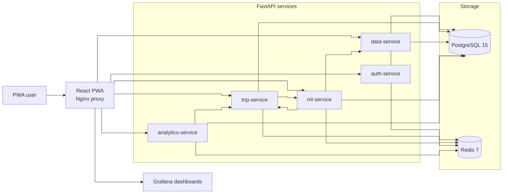

<p align="center">
  
  <h1 align="center">Triply</h1>
</p>

<p align="center">
  <b>AI-планировщик путешествий: персональные рекомендации направлений, прогноз бюджета, маршруты, дневник поездки и контроль расходов в одном PWA-продукте.</b>
</p>

<p align="center">
  
  
  
  
  
  
  
  
</p>

Triply помогает спланировать самостоятельную поездку от первого выбора направления до итогов после возвращения. Приложение объединяет профиль пользователя, каталог направлений, POI, визовые правила, сезонность, безопасность, стоимость жизни, аналитику поведения и ML-модели в единый сценарий: подобрать направление, проверить ограничения, оценить бюджет, собрать маршрут, вести дневник и контролировать расходы.

Репозиторий содержит React PWA, пять FastAPI-сервисов, PostgreSQL/Redis-инфраструктуру, Grafana-дашборды, Alembic-миграции, ETL-скрипты и код для обучения/инференса ML-моделей.

## Возможности

- **Персональные рекомендации направлений**: content-based candidate generation + LightGBM LambdaRank reranking.
- **Расширенный профиль путешественника**: город вылета, гражданство, типы отдыха, бюджет, климат, риск-толерантность, языковые предпочтения и любимые направления.
- **Проверка направления перед планированием**: визовые условия, безопасность, сезон, длительность поездки и языковой комфорт.
- **Прогноз бюджета** до поездки и мониторинг бюджета во время поездки с p10/p50/p90 диапазонами, определением регулярных трат и драйверами расходов.
- **Itinerary Engine**: черновики маршрутов, выбор варианта, регенерация, ручное редактирование, drag-and-drop между днями, редактирование таймлайна и карта дня.
- **Дневник поездки**: посещенные места, заметки, даты, время визита и геокодинг на карте.
- **Учет расходов**: категории, валюты, конвертация через FXRatesAPI и прогресс по бюджету.
- **Итоги поездки**: общие траты, средний расход в день, количество мест, длительность, бюджетный статус и post-trip feedback.
- **Авторизация**: логин/пароль, JWT-сессии, Yandex OAuth и сброс пароля через email.
- **Продуктовая аналитика**: события рекомендаций, кликов, создания поездок, расходов, маршрутов и отзывов.

## Данные И ML

Triply построен вокруг базы направлений и набора offline-trained моделей.

| Область              | Текущее состояние репозитория                                                             |
| -------------------- | ----------------------------------------------------------------------------------------- |
| Направления          | 1 111 всего, 1 038 активных после дедупликации                                            |
| POI-каталог          | 2.1M+ точек интереса из OTM, OSM Overpass и heritage datasets                             |
| Визовые правила      | 220k+ правил для пар паспорт / направление                                                |
| Сезонность           | Помесячные погодные и комфорт-сигналы по направлениям                                     |
| Feature matrix       | Safety, costs, activities, popularity, attributes, language, connectivity, infrastructure |
| Ranker               | `hybrid-ranker-v2`, LightGBM LambdaRank, 82 features                                      |
| Budget model         | LightGBM residual/quantile model поверх формульного baseline                              |
| In-trip budget model | LightGBM residual/quantile model для прогноза оставшихся трат                             |
| Itinerary engine     | Персонализированная optimized heuristic с persisted variants и edit workflow              |

ML-слой рассчитан на graceful degradation: рекомендации fallback-ятся к content scorer, бюджет к формульному расчету, а itinerary ranking к эвристическому scoring, если trained artifact недоступен.

## Архитектура



| Сервис              |              Порт | Зона ответственности                                                                    |
| ------------------- | ----------------: | --------------------------------------------------------------------------------------- |
| `frontend`          |         80 / 5173 | React PWA, runtime env, Nginx proxy, вход в Grafana                                     |
| `auth-service`      |              8001 | Регистрация, логин, JWT, blacklist токенов, Yandex OAuth, сброс пароля                  |
| `trip-service`      |              8002 | Поездки, расходы, места, профиль, onboarding, push subscriptions, persisted itineraries |
| `data-service`      |              8003 | Каталог направлений, POI, карты, геокодинг, данные для маршрутов                        |
| `ml-service`        |              8004 | Рекомендации, validation, бюджет, budget monitoring, itinerary scoring                  |
| `analytics-service` |              8005 | Event ingestion, feedback, user features, experiments, admin analytics                  |
| `grafana`           | 3001 / `/grafana` | Дашборды продуктовой аналитики                                                          |

## Стек

| Слой          | Технологии                                                                                 |
| ------------- | ------------------------------------------------------------------------------------------ |
| Frontend      | React 19, TypeScript 5.9, Vite 7, React Router, TanStack Query, React Hook Form, Zod       |
| UI            | Tailwind CSS, Radix UI, shadcn-style primitives, Lucide Icons, Framer Motion, Vaul drawers |
| PWA           | Vite PWA Plugin, Workbox, service worker, push notifications                               |
| Backend       | Python 3.11, FastAPI, Pydantic v2, SQLAlchemy 2.0, Alembic, Uvicorn                        |
| ML / Data     | LightGBM, scikit-learn, pandas, numpy, joblib, rapidfuzz                                   |
| Storage       | PostgreSQL 15, Redis 7                                                                     |
| Auth          | JWT, Redis token blacklist, Yandex OAuth 2.0, Argon2 password hashing                      |
| Maps / Geo    | Yandex Maps JS API v3, Yandex Geocoder, Yandex Geosuggest, Geoapify                        |
| Observability | Grafana OSS with PostgreSQL datasource                                                     |
| Tooling       | Docker Compose, Ruff, Pyright, ESLint, TypeScript, Steiger, GitHub Actions                 |

## Структура Репозитория

```text
frontend/                   React PWA на Feature-Sliced Design
services/
  auth-service/             Auth, sessions, OAuth, reset password
  trip-service/             Trips, expenses, diary, profile, itinerary state
  data-service/             Destination/POI catalog, maps, geocoding, ETL
  ml-service/               ML serving, training scripts, validation, budgets
  analytics-service/        Events, feedback, user features, experiments
infra/grafana/              Provisioned dashboards and datasource
docs/analytics-event-taxonomy.md
docker-compose.yml          Local stack
docker-compose.prod.yml     Production stack
Makefile                    Development, ETL, training and deploy commands
```

## Быстрый Старт

### Требования

- Docker и Docker Compose
- Node.js 20+ для локальной frontend-разработки
- Python 3.11+ для локальной backend-разработки

### 1. Настройте окружение

```bash
cp .env.docker.example .env.docker
```

Для запуска через Docker Compose укажите хост базы данных как имя Docker-сервиса:

```env
DATABASE_URL=postgresql://postgres:<password>@postgres:5432/travel_planner
REDIS_URL=redis://redis:6379
```

Сгенерируйте секреты:

```bash
openssl rand -hex 32
```

Используйте их для `JWT_SECRET`, `INTERNAL_API_SECRET` и `DATA_SERVICE_SECRET`.

### 2. Запустите весь стек

```bash
make build
make up
```

Первый build может занять несколько минут: сервисы устанавливают Python- и Node-зависимости.

### 3. Примените миграции

```bash
make migrate
```

### 4. Откройте приложение

| Цель               | URL                        |
| ------------------ | -------------------------- |
| Frontend           | http://localhost           |
| Auth API docs      | http://localhost:8001/docs |
| Trip API docs      | http://localhost:8002/docs |
| Data API docs      | http://localhost:8003/docs |
| ML API docs        | http://localhost:8004/docs |
| Analytics API docs | http://localhost:8005/docs |
| Grafana            | http://localhost:3001      |

## Hybrid Development

Инфраструктуру можно оставить в Docker, а сервисы запускать локально:

```bash
docker compose up -d postgres redis

cd services/auth-service && uvicorn app.main:app --reload --port 8001
cd services/trip-service && uvicorn app.main:app --reload --port 8002
cd services/data-service && uvicorn app.main:app --reload --port 8003
cd services/ml-service && uvicorn app.main:app --reload --port 8004
cd services/analytics-service && uvicorn app.main:app --reload --port 8005

cd frontend && npm run dev
```

Для hybrid-режима используйте host URLs там, где локальные процессы должны ходить на локальные порты, например `DATABASE_URL=postgresql://postgres:<password>@localhost:5432/travel_planner` и `FRONTEND_URL=http://localhost:5173`.

## Ключи И Переменные Окружения

Большая часть интеграций опциональна для локального знакомства с проектом, но полный пользовательский сценарий требует следующие ключи.

| Переменная                                               | Для чего нужна                                             | Где взять                                                                                  |
| -------------------------------------------------------- | ---------------------------------------------------------- | ------------------------------------------------------------------------------------------ |
| `JWT_SECRET`                                             | Подпись auth-токенов                                       | Сгенерировать локально: `openssl rand -hex 32`                                             |
| `INTERNAL_API_SECRET`                                    | Защита internal endpoints в data-service                   | Сгенерировать локально: `openssl rand -hex 32`                                             |
| `DATA_SERVICE_SECRET`                                    | Доступ ML-сервиса к data-service                           | Сгенерировать локально: `openssl rand -hex 32`                                             |
| `YANDEX_CLIENT_ID`, `YANDEX_CLIENT_SECRET`               | Вход через Yandex OAuth                                    | OAuth-приложение в Yandex ID / Yandex Cloud developer console                              |
| `YANDEX_REDIRECT_URI`                                    | Callback для OAuth                                         | Локально: `http://localhost:80/auth/yandex/callback`; в production: callback вашего домена |
| `SMTP_HOST`, `SMTP_PORT`, `SMTP_USER`, `SMTP_PASSWORD`   | Письма для сброса пароля                                   | SMTP-аккаунт, например Yandex 360 / app password                                           |
| `FXR_API_KEY`                                            | Конвертация валют                                          | Аккаунт FXRatesAPI на `fxratesapi.com`                                                     |
| `YANDEX_MAPS_API_TOKEN`                                  | Yandex Maps JS API                                         | Yandex Developer Dashboard / JavaScript API and Geocoder                                   |
| `YANDEX_GEOCODER_API_KEY`                                | Геокодинг                                                  | Yandex Developer Dashboard / Geocoder API                                                  |
| `YANDEX_GEOSUGGEST_API_KEY`                              | Подсказки адресов                                          | Yandex Developer Dashboard / Geosuggest API                                                |
| `GEOAPIFY_API_KEY`                                       | Fallback-геокодинг                                         | Geoapify dashboard                                                                         |
| `TRAVELPAYOUTS_API_TOKEN`                                | Cached route fare enrichment                               | Travelpayouts / Aviasales API account                                                      |
| `LLM_API_KEY`, `LLM_FOLDER_ID`                           | Опциональный LLM quality gate для рекомендаций и маршрутов | Yandex Cloud AI Studio                                                                     |
| `LLM_MODEL`                                              | ID LLM-модели                                              | Скопировать exact model id из Yandex AI Studio model gallery                               |
| `VAPID_PUBLIC_KEY`, `VAPID_PRIVATE_KEY`, `VAPID_SUBJECT` | Web push notifications                                     | `npx web-push generate-vapid-keys`                                                         |
| `GF_SECURITY_ADMIN_USER`, `GF_SECURITY_ADMIN_PASSWORD`   | Вход в Grafana                                             | Задать собственные admin credentials                                                       |
| `VITE_API_URL`                                           | Кастомный frontend API base                                | Обычно пусто при Docker/Nginx proxy                                                        |
| `VITE_GRAFANA_DASHBOARD_URL`                             | Ссылка на analytics dashboard во frontend                  | По умолчанию `/grafana/d/triply-analytics/...`                                             |

## Команды

| Команда                            | Описание                                         |
| ---------------------------------- | ------------------------------------------------ |
| `make build`                       | Собрать Docker-образы без cache                  |
| `make up`                          | Запустить Docker stack                           |
| `make down`                        | Остановить контейнеры и удалить volumes          |
| `make logs`                        | Смотреть логи сервисов                           |
| `make migrate`                     | Применить Alembic-миграции всех backend-сервисов |
| `make test`                        | Запустить backend-тесты в Docker                 |
| `make test-cov`                    | Запустить backend-тесты с coverage               |
| `make lint`                        | Backend typecheck и Ruff                         |
| `cd frontend && npm run lint`      | ESLint и FSD architecture check                  |
| `cd frontend && npm run typecheck` | TypeScript typecheck                             |
| `cd frontend && npm run build`     | Production build frontend                        |
| `make gen-ltr-pairs`               | Сгенерировать training pairs для ranker          |
| `make train-ranker`                | Обучить и зарегистрировать destination ranker    |
| `make train-budget`                | Обучить и зарегистрировать budget model          |
| `make build-features`              | Пересобрать destination feature snapshot         |

## Проверки

```bash
make test
make lint

cd frontend
npm run lint
npm run typecheck
npm run build
```

GitHub Actions запускает backend lint/tests, frontend lint/typecheck/dependency checks и Docker build для основных deployable сервисов.

## База Данных И Data Workflows

Каждый backend-сервис владеет своими Alembic-миграциями, при этом все сервисы используют общую PostgreSQL-базу.

```bash
make migrate
```

Data и ML workflows вынесены в Makefile:

```bash
make seed-data
make fetch-poi-osm LIMIT=1000
make fetch-poi-otm LIMIT=1000
make compute-activities
make refresh-seasonality
make gen-budget-data
make gen-ltr-pairs
make train-ranker
make train-budget
```

Полные POI/data backfills обращаются к внешним провайдерам и могут упираться в rate limits. Для обычной локальной разработки лучше использовать committed seed/ETL scripts и запускать полные внешние backfills только при необходимости обновить датасет.

## Deployment

В репозитории есть production Compose и GitHub Actions workflow. При push в `main` CI выполняет lint/typecheck/build, деплоит проект на VM по SSH, применяет новые Alembic-миграции, накатывает deterministic seed updates при изменении соответствующих файлов и переобучает затронутые ML-модели, если изменились training inputs.

Production Compose обслуживает frontend на 80/443 и использует `frontend/nginx.prod.conf` с сертификатами, смонтированными из `/etc/letsencrypt`.

## Security Notes

- Не коммитьте `.env.docker`, `.env.prod`, dumps, API keys и generated secrets.
- Используйте strong random secrets для JWT и internal service communication.
- Ограничивайте OAuth redirect URIs точными local/production callback URL.
- Grafana не anonymous по умолчанию: задайте нестандартный admin password.

## License

Проект распространяется под лицензией [MIT](LICENSE).
